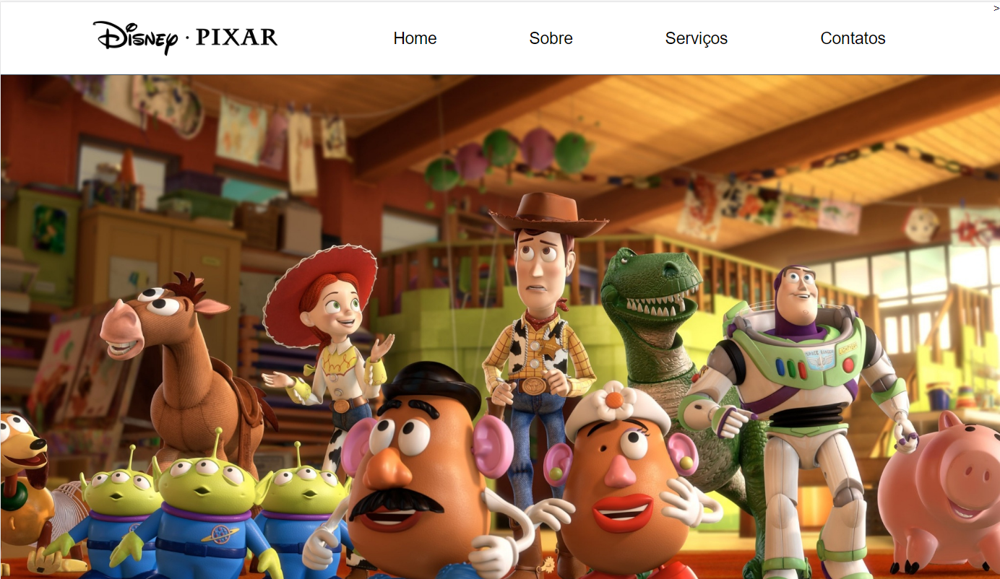

# Learning-WEB

Repository for not only put the projects that I do to learn and improve my web development skills, but also show my growth. 
Here you can find some Web sites that I've recreated to practise and learn HTML, CSS and finally JavaScript. As I said before. in some of the projects in this repository, I used actual web sites as inspiration, to try to reproduce what already exists, and so improve my skills.

## 1. Travel Agency

## 2. Pixar

## 3. World Wide Fund for Nature

